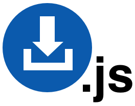

blue-button
==========

Blue Button JavaScript (Node.js) library

[](https://nodei.co/npm/blue-button/)

[](https://travis-ci.org/amida-tech/blue-button)
[](https://coveralls.io/r/amida-tech/blue-button)



## Library interfaces/APIs

This library provides the following functionality

- Parse XML documents (via libxmljs)
- Sense type of data (e.g. CCDA, CMS, C32, etc)
- Parse CCDA into JSON representation
	- Parse CCDA elements (sections) into JSON representation
- Parse CMS into JSON representation
  - Parse CMS elements (sections) into JSON representation
- Generate JSON object based on data model

### Usage example

Require blue-button module

``` javascript
var bb = require("blue-button")
```

Load some XML and parse it

``` javascript
var data = "some CCDA.xml data here...";

//parse xml into JS object
var doc = bb.parseXml(data);
```

Check XML parsing errors

``` javascript
console.log(doc.errors);
```

should be:

``` javascript
[]
``` 

here is XML itself:

``` javascript
console.log(doc.toString());
```

should be:

``` xml
<?xml version="1.0" encoding="UTF-8" standalone="yes"?>
<?xml-stylesheet type="text/xsl" href="CDA.xsl"?>
<!-- Title: US_Realm_Header_Template -->
<ClinicalDocument xmlns:xsi="http://www.w3.org/2001/XMLSchema-instance" xmlns="urn:hl7-org:v3" xmlns:cda="urn:hl7-org:v3" xmlns:sdtc="urn:hl7-org:sdtc">
  <!-- ******************************************************** CDA Header 
		******************************************************** -->
  <realmCode code="US"/>
  <typeId root="2.16.840.1.113883.1.3" extension="POCD_HD000040"/>
  <!-- US General Header Template -->
  <templateId root="2.16.840.1.113883.10.20.22.1.1"/>
  <!-- *** Note: The next templateId, code and title will differ depending 
		on what type of document is being sent. *** -->
  <!-- conforms to the document specific requirements -->
  <templateId root="2.16.840.1.113883.10.20.22.1.2"/>
  
  ...and so on
```

Let's sense document type from parsed XML:

``` javascript
//get document type (e.g. CCDA) of parsed document
var type = bb.senseXml(doc);

console.log(type);
```

getting:

``` javascript
{ type: 'ccda' }
```

Let's sense document type from string with health data:

``` javascript
//get document type (e.g. CCDA) of document from string (and return parsed xml if it is xml based type)
var result = bb.senseString(data);

//printing result:
console.log(result);
```

getting type as well as parsed XML for later user:

``` javascript
{ type: 'ccda', xml: { errors: [] } }
//xml "errors" is just default print of libxmljs parsed XML object

//in case of JSON stringified input, it will return {type: 'json', json: [json object here]}
```

Sensing CMS Blue Button data in text file:

``` javascript
//get document type (e.g. CMS) of document from string (and return format version)
var result = bb.senseString(data);

//printing result:
console.log(result); 
```
getting:

``` javascript
{ type: 'cms', version: '2.0' }
```

getting type as well as parsed XML for later user:

``` javascript

{ type: 'ccda', xml: { errors: [] } }
//xml "errors" is just default print of libxmljs parsed XML object

//in case of JSON stringified input, it will return {type: 'json', json: [json object here]}

```

Parsing into JSON data model from CMS text file

``` javascript
//read in the file
var textString = fs.readFileSync("cms_sample.txt").toString(); 

//convert the string text file into blue button model
var result = bb.parseText(textString); 

console.log(result);
```
getting:

``` javascript

{ data: 
   { demographics: 
      { name: [Object],
        dob: [Object],
        email: [Object],
        phone: [Object],
        address: [Object] },
     vitals: [ [Object], [Object] ],
     results: [ [Object] ],
     medications: [ [Object], [Object] ],
     allergies: [ [Object], [Object] ],
     immunizations: [ [Object], [Object], [Object] ],
     problems: [ [Object], [Object] ],
     insurance: [ [Object], [Object], [Object], [Object], [Object], [Object] ],
     claims: [ [Object], [Object], [Object], [Object], [Object] ] },
  meta: 
   { type: 'cms',
     version: '2.0',
     timestamp: { date: '2013-03-16T05:10:00Z', precision: 'minute' },
     sections: ['demographics', ..., 'claims'] } }

``` 

Parsing into JSON data model from XML or from string

``` javascript
//convert Xml document into JSON
var result = bb.parseXml(doc);

//convert string into JSON
var result = bb.parseString(data);

console.log(result);
```

getting:

``` javascript
{ data: 
   { demographics: 
      { name: [Object],
        dob: [Object],
        ...
        birthplace: [Object],
        guardians: [Object] },
     vitals: [ [Object], [Object], [Object], [Object], [Object], [Object] ],
     results: [ [Object] ],
     medications: [ [Object] ],
     encounters: [ [Object] ],
     allergies: [ [Object], [Object], [Object] ],
     immunizations: [ [Object], [Object], [Object], [Object] ],
     socialHistory: [ [Object] ],
     problems: [ [Object], [Object] ],
     procedures: [ [Object], [Object], [Object] ] },
  meta: {
        version: "1.1.0-beta.1",
        sections: [
            "demographics",
            "vitals",
            "results",
            "medications",
            "encounters",
            "allergies",
            "immunizations",
            "social_history",
            "problems",
            "procedures",
            "plan_of_care",
            "payers"
        ]
  },
  errors: 
   [ 'nullFlavor alert:  missing but required streetLines in Address -> Patient -> CCD',
     'nullFlavor alert:  missing but required value in PhysicalQuantity -> MedicationAdministration -> Prescription -> MedicationsSection -> CCD'
     ] }
```

See [/example](./example) for example above as well as how to parse individual sections.
***

## Data Model

Data model details and validation can be found in [blue-button-model](https://github.com/amida-tech/blue-button-model).

## Goals

- Full support of CCDA
- Ability to extend to support other data formats (e.g. C32)
- Solid, well-documented JSON-based data model for patient health data
- Modularity - easy to extend (both parser and data model) in the future
- Node.js support
- Browser support (sometime later)
- Speed of parsing
- Well tested on entire corpora of CCDA samples from https://github.com/jmandel/sample_ccdas

## Future Roadmap

- C32 support reintroduced
- Merge back into bluebutton.js repo
- Refactoring into smaller components (sub-modules)

## Contributing

Contributors are welcome. See issues https://github.com/amida-tech/blue-button/issues

## Release Notes

See release notes [here] (./RELEASENOTES.md)

## License

Licensed under [Apache 2.0](./LICENSE)

Project was influenced by and used some code from:

[bluebutton.js library](https://github.com/blue-button/bluebutton.js/) licensed under [MIT](https://github.com/blue-button/bluebutton.js/blob/master/LICENSE.md)

[Josh Mandel's ccda-to-json library](https://github.com/jmandel/ccda-to-json) licensed under [Apache 2.0] (https://github.com/jmandel/ccda-to-json/blob/master/LICENSE)

